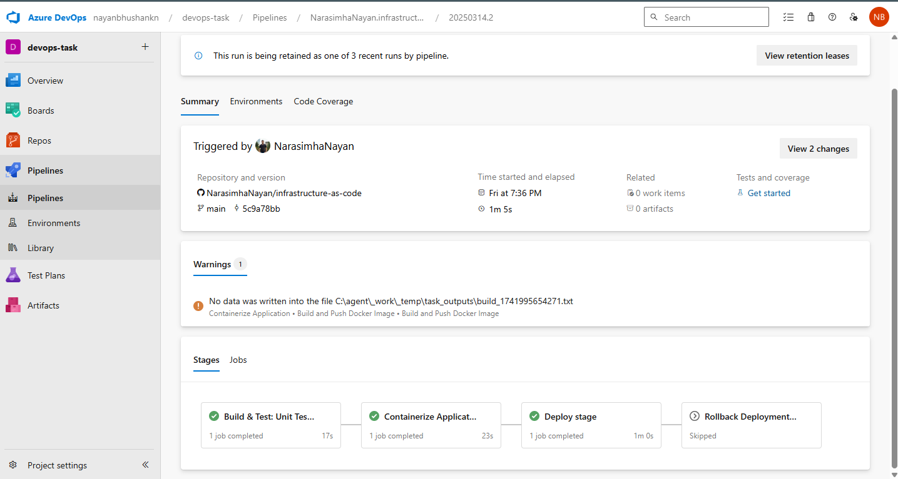
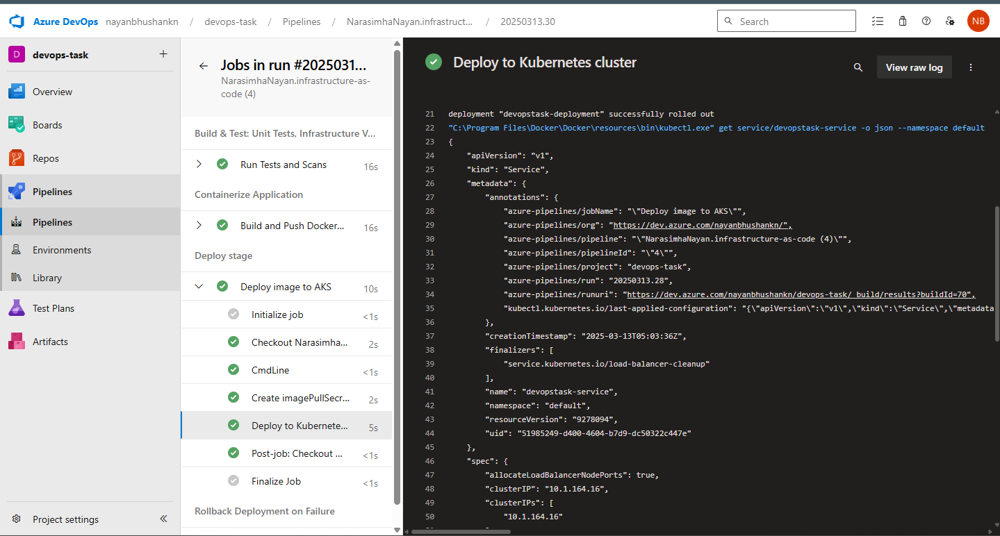
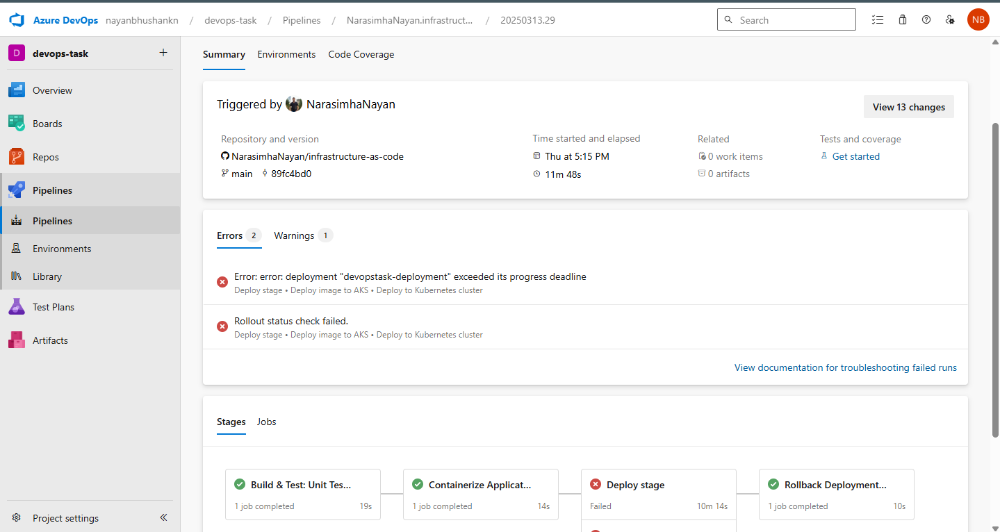
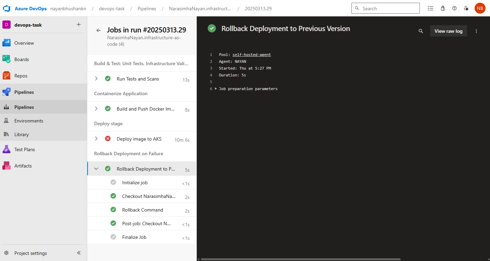
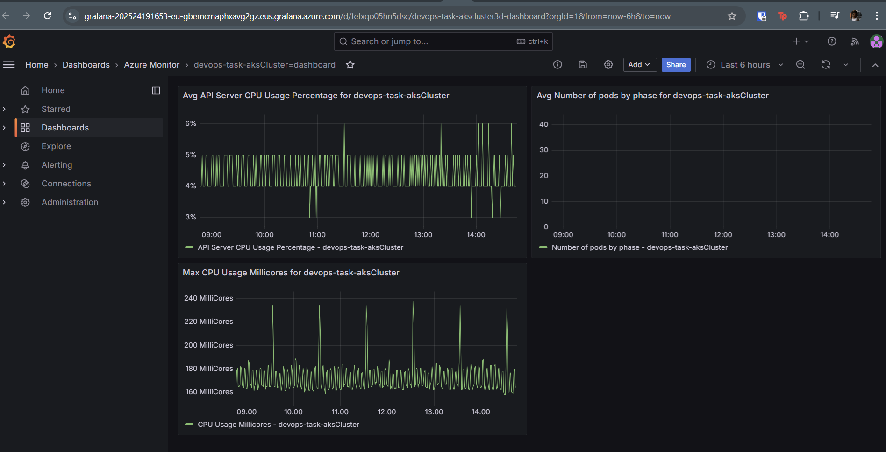
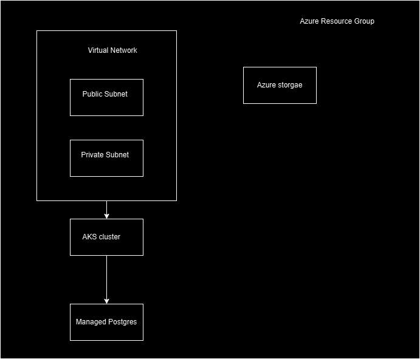

# Infrastructure-as-Code & CI/CD Pipeline for DevOps Task

This repository contains the complete solution for deploying a secure, automated infrastructure on Azure. The solution encompasses Infrastructure as Code (IaC), CI/CD pipelines, monitoring, and data processing for vulnerability analysis.

---

## Table of Contents

- [Overview](#overview)
- [Setup Instructions](#setup-instructions)
- [Local Development Instructions](#local-development-instructions)
- [Infrastructure Deployment (Terraform)](#infrastructure-deployment-terraform)
- [CI/CD Pipeline Setup (Azure Pipelines)](#ci-cd-pipeline-setup-azure-pipelines)
- [Monitoring Setup](#monitoring-setup)
- [Data Processing](#data-processing)
- [Architecture Diagram](#architecture-diagram)
- [Design Decisions and Trade-offs](#design-decisions-and-trade-offs)
- [Troubleshooting Guide](#troubleshooting-guide)
- [Project Structure and Contents](#project-structure-and-contents)
- [Access to Configurations](#access-to-configurations)
- [References](#references)

---

## Overview

This project implements an end-to-end solution on Azure, divided into four main parts:

1. **Infrastructure as Code (Terraform):**  
   - Provisions a Virtual Network (with public and private subnets), an AKS cluster, a managed PostgreSQL database, NSGs, IAM roles, and Azure Storage.
   - Uses custom modules for network components.
   - Follows security best practices.

2. **CI/CD Pipeline (Azure Pipelines):**  
   - Builds, tests, and containerizes the sample application ([DevOps-task](https://github.com/chanduusc/Devops-task)).
   - Pushes Docker images to Azure Container Registry (ACR).
   - Deploys the application to the AKS cluster with automated rollback capability.
   - Incorporates quality gates and secure secret management (via Azure Key Vault).

3. **Monitoring Solution:**  
   - Enables Azure Monitor for Containers to collect application metrics.
   - Aggregates logs into a Log Analytics workspace.
   - Uses Grafana dashboards for visualization.
   - Configures custom alerts for infrastructure health, application performance, and error rates.

4. **Data Processing:**  
   - Implements SQL queries to retrieve and analyze vulnerability data (using vulnerability severity) from the managed PostgreSQL database.
   - Provides insights on total vulnerabilities, trends, and high-risk details.

---

## Setup Instructions

### Prerequisites
- An active Azure subscription.
- Azure CLI installed locally.
- Terraform installed.
- Access to Azure DevOps with necessary permissions.
- For local development: Go installed, Docker installed, and if using a Windows self-hosted agent, Git Bash or equivalent.

## Local Development Instructions

1. **Clone the Repository:**
   ```bash
   git clone https://github.com/NarasimhaNayan/infrastructure-as-code.git
   cd infrastructure-as-code
   ```
2. **Terraform Setup:**
   - Install Terraform.
   - Run `terraform init` and `terraform plan` to preview changes.
3. **Docker and Go Setup:**
   - Ensure Docker and Go are installed locally.
   - Use the provided Dockerfile to build and test your containerized application.
4. **Run Tests:**
   - Execute `go test ./...` to run unit tests.
5. **Database Connection:**
   - Use the provided `DATABASE_URL` environment variable to connect to your cloud-hosted PostgreSQL database.

---

## Project Structure and Contents

- **/modules:**  
  Contains custom Terraform modules (e.g., network configuration).
- **main.tf, variables.tf, outputs.tf:**  
  Root Terraform configuration files.
- **azure-pipelines.yml:**  
  Pipeline definitions for CI/CD.
- **manifests:**  
  Kubernetes manifests (deployment.yml, service.yml) for deploying the containerized application.
- **Dockerfile:**  
  Dockerfile for building the container image.
- **security-scan.sh:**  
  Shell script for running security scans using Trivy.
- **sql:**  
  SQL files containing queries for data processing related to vulnerability severity.
- **README.md:**  
  This documentation file.

---

## Access to Configurations

- **Source Code:** Available in this repository.
- **Infrastructure Configurations:** Terraform files are provided in the repository.
- **Pipeline Definitions:** The `azure-pipelines.yml` file defines the CI/CD pipeline.
- **Monitoring Configurations:** Documentation on monitoring (including alert configurations and references) is included here and in linked Azure Monitor dashboards.
- **Documentation:** This README.md and additional supporting documents (if any) provide comprehensive documentation.

---

## Infrastructure Deployment (Terraform)
1. **Clone the Repository:**
   ```bash
   git clone https://github.com/NarasimhaNayan/infrastructure-as-code.git
   cd infrastructure-as-code
   ```
2. **Initialize Terraform:**
   ```bash
   terraform init
   ```
3. **Plan the Deployment:**
   ```bash
   terraform plan
   ```
4. **Apply the Configuration:**
   ```bash
   terraform apply -auto-approve
   ```
   `-auto-approve` helps to run terraform apply without waiting for approval.
5. **Destroy the Infrastructure (when needed):**
   ```bash
   terraform destroy
   ```

## CI/CD Pipeline Setup (Azure Pipelines)
1. **Configure Service Connections:**
   - Create a service connection for your Azure Container Registry.
   - Create a service connection for Azure subscriptions/AKS.
2. **Set Up Azure Key Vault:**
   - Create an Azure Key Vault.
   - Add secrets (e.g., `imagePullSecret`, `DATABASE_URL`).
   - Link these secrets to Azure Pipelines via a variable group.
3. **Review and Commit Pipeline YAML:**
   - The `azure-pipelines.yml` file is included at the repository root.
   - Ensure that all variables (such as `vmImageName`, `containerRegistry`, etc.) are correctly set.
4. **Run the Pipeline:**
   - Trigger a build by pushing to `main` or `develop`. Here the branching strategy that I have assumed is `develop` branch would be for developement and `main` branch would be the production branch. For simplicity I am ensuring trigger on both the branches.

Below are some key points detailing the challenges encountered during the pipeline setup, how they were resolved, and an explanation of how this pipeline was developed and what each part does:

---

### Challenges Faced and Solutions

- **Hosted Agent Parallelism Issue:**  
  **Challenge:** Initially, using the Microsoft‑hosted pool (`ubuntu-latest`) resulted in the error “No hosted parallelism has been purchased or granted.”  
  **Solution:** I set up a self‑hosted agent (using a Windows machine) to run the pipelines. This involved configuring the agent, installing necessary tools, and updating the pipeline YAML to reference `self-hosted-agent` as the pool.

- **Tool Installation on Self-Hosted Agent:**  
  **Challenge:** The self‑hosted agent did not have Go and Trivy pre-installed, which caused build and security scan steps to fail.  
  **Solution:** I added script steps in the pipeline to check for Go and Trivy. For Windows, I used Chocolatey to install these tools if they weren’t found. This ensured that unit tests (`go test ./...`) and the security scan (via Trivy) could run successfully.

- **Secrets Management:**  
  **Challenge:** Hardcoding secrets in the pipeline is insecure. I needed a secure method to provide credentials such as `DATABASE_URL` and `imagePullSecret`.  
  **Solution:** I stored these secrets in Azure Key Vault and linked them to Azure Pipelines via a variable group. This allowed the pipeline to dynamically fetch the secrets without exposing them in the YAML.

- **Variable Substitution in Manifests:**  
  **Challenge:** Ensuring that the image tag and other variables (e.g., `DATABASE_URL`) are correctly passed to the deployment manifests in Kubernetes.  
  **Solution:** I configured the pipeline to substitute these variables, and I ensured that the deployment manifest references (such as the container image and secret names) match the variables defined in the pipeline.

- **Rollback Handling:**  
  **Challenge:** Implementing an automated rollback when the deployment fails and ensuring the rollback command runs correctly on the self-hosted agent.  
  **Solution:** I added a dedicated rollback stage that fetches AKS credentials and uses `kubectl rollout undo` to revert the deployment if needed.

---

### Explanation of the Azure Pipelines YAML

1. **Variables Section:**  
   - Defines critical variables such as container registry connection, image repository, Dockerfile path, and secrets (e.g., `DATABASE_URL` and `imagePullSecret`).
   - These variables are used throughout the pipeline to ensure consistency and allow dynamic substitution.

2. **Stage 1: AutomatedTesting:**  
   - **Purpose:** Runs unit tests and validates infrastructure using Terraform.
   - **Key Steps:**
     - Checks out the repository.
     - Installs Go if it’s not already installed using Chocolatey (for Windows).
     - Runs `go test ./...` to execute unit tests.
     - Runs Terraform initialization and validation to check the IaC code.
   - **Outcome:** Confirms that the code and infrastructure definitions are correct before proceeding.

3. **Stage 2: Containerize:**  
   - **Purpose:** Builds the Docker image from the Dockerfile and pushes it to Azure Container Registry.
   - **Key Steps:**
     - Checks out the repository.
     - Uses the Docker@2 task to build and push the image, tagging it with the build ID.
     - Runs a Bash script (via Bash@3) to install Trivy and run a security scan against the built image.
   - **Outcome:** Produces a secure container image that has been scanned for vulnerabilities.

4. **Stage 3: Deploy:**  
   - **Purpose:** Deploys the containerized application to the AKS cluster.
   - **Key Steps:**
     - Checks out the repository.
     - Creates an imagePullSecret in AKS to allow pulling from the private ACR.
     - Deploys the application using Kubernetes manifests (deployment and service) and passes necessary environment variables like `DATABASE_URL`.
   - **Outcome:** The application is deployed to AKS with proper configurations.

5. **Stage 4: Rollback:**  
   - **Purpose:** Automatically rolls back the deployment if it fails.
   - **Key Steps:**
     - Fetches AKS credentials.
     - Checks the deployment’s rollout history.
     - Executes a rollback command if the deployment exceeds its progress deadline.
   - **Outcome:** Provides a safety mechanism to revert to a previous stable deployment.

---

### Snapshots of pipeline running






---

## Monitoring Setup

This section describes the monitoring solution implemented for the DevOps Task project deployed on Azure. The monitoring solution is designed to provide full visibility into both the infrastructure and application performance in the AKS cluster. It includes metrics collection, log aggregation, dashboard visualization using Grafana, and custom alerting for critical conditions.

---

## Overview

The monitoring solution consists of the following key components:

- **Azure Monitor for Containers (Container Insights):**  
  Enables automatic collection of performance metrics and logs from the AKS cluster.
  
- **Log Analytics Workspace:**  
  Aggregates logs and telemetry data from the cluster and the containerized application.
  
- **Grafana Dashboards:**  
  Provides rich, customizable visualizations for metrics and logs collected by Azure Monitor.
  
- **Custom Alerts:**  
  Alerts have been configured to notify on:
  - **Infrastructure Health:** Monitors node and cluster resource utilization.
  - **Application Performance:** Tracks metrics such as request duration and throughput.
  - **Error Rates:** Detects increased error log entries (e.g., using log-based queries).

---

## Components and Setup

### 1. Azure Monitor for Containers (Container Insights)

- **Purpose:**  
  Automatically collects CPU, memory, network metrics, and container logs from your AKS cluster.
  
- **Configuration:**  
  - Enabled via the Azure Portal or CLI.
  - The AKS cluster is connected to a Log Analytics workspace.
  
- **Reference Resources:**  
  - [Enable Kubernetes Monitoring with Container Insights](https://learn.microsoft.com/en-us/azure/azure-monitor/containers/kubernetes-monitoring-enable?tabs=cli#enable-prometheus-and-grafana)
  - [Prometheus Metrics Overview](https://learn.microsoft.com/en-us/azure/azure-monitor/essentials/prometheus-metrics-overview)

### 2. Log Analytics Workspace

- **Purpose:**  
  Aggregates and stores logs and performance metrics collected by Container Insights.
  
- **Usage:**  
  - Provides a central place to run queries on collected logs.
  - Supports setting retention policies for long-term storage of logs.
  
- **Data Platform Metrics:**  
  - Azure Monitor also collects platform-level metrics.  
  - [Data Platform Metrics Overview](https://learn.microsoft.com/en-us/azure/azure-monitor/essentials/data-platform-metrics)

### 3. Grafana Dashboard

- **Purpose:**  
  Visualizes the collected metrics and logs, providing actionable insights and a real-time view of system health.
  
- **Setup Options:**  
  - **Managed Grafana on AKS:**  
    Follow a step-by-step guide, such as the one available on Medium:  
    [A Step-by-Step Guide to Configuring Managed Grafana on AKS](https://medium.com/@techcomputerscience001/a-step-by-step-guide-to-configuring-managed-grafana-on-aks-be68daae0c2a)
  - **Integration with Prometheus:**  
    Use Azure Monitor’s Prometheus-compatible metrics to feed Grafana panels.

### 4. Custom Alerts

Custom alerts have been configured in Azure Monitor to provide proactive notifications:

#### a. Infrastructure Health Alert

- **Metric:**  
  For example, node CPU usage, memory utilization, or available node count.
- **Threshold:**  
  Trigger an alert if, for instance, CPU usage exceeds 80% over a 5-minute window.
- **Alerting:**  
  Configured via the Azure Portal under **Monitor > Alerts > Alert rules**.

#### b. Application Performance Alert

- **Metric:**  
  Performance metrics from Application Insights (e.g., average request duration).
- **Query Example:**  
  Using a log alert query in Application Insights:
  ```kusto
  requests
  | summarize avgDuration = avg(duration) by bin(timestamp, 5m)
  | where avgDuration > 1000
  ```
- **Threshold:**  
  Alert if average response time exceeds 1000 ms over 5 minutes.
- **Configuration:**  
  Set up in Azure Monitor using a custom log search alert.

#### c. Error Rate Alert

- **Metric:**  
  Monitors error logs using queries against log data (e.g., container logs).
- **Query Example:**  
  ```kusto
  ContainerLog
  | where LogEntry contains "ERROR"
  | summarize errorCount = count() by bin(TimeGenerated, 5m)
  | where errorCount > 10
  ```
- **Threshold:**  
  Trigger an alert if more than 10 error entries are detected within any 5-minute window.
- **Configuration:**  
  Created as a custom log search alert in Azure Monitor.

---

## Deployment and Configuration Steps

### Enabling Container Insights Via Azure Portal:  
   - Navigate to your AKS cluster resource.
   - Under **Monitoring**, click **Insights**.
   - If Container Insights isn’t enabled, click **Enable monitoring** and link your AKS cluster to an existing Log Analytics workspace.

### Setting Up Grafana Dashboard

1. **Deploy Grafana on AKS or Use Managed Grafana:**  
   - Follow the guide on [Managed Grafana on AKS](https://medium.com/@techcomputerscience001/a-step-by-step-guide-to-configuring-managed-grafana-on-aks-be68daae0c2a) to deploy Grafana.
   - Configure Grafana to connect to your Log Analytics workspace or Prometheus endpoint.

2. **Create Custom Dashboards:**  
   - Use Grafana’s dashboard editor to create panels that display key metrics (e.g., CPU usage, memory usage, error counts).
   - Save and share screenshots as part of your documentation.

### Configuring Alerts

1. **Create Alert Rules in Azure Monitor:**  
   - Navigate to **Monitor > Alerts** in the Azure Portal.
   - Click **+ Create > Alert rule**.
   - Select the appropriate resource (AKS cluster for infrastructure alerts, Application Insights for performance alerts, or Log Analytics workspace for log alerts).
   - Define the condition using a metric or custom log query, set the threshold, and configure the evaluation frequency.
   - Associate the alert rule with an action group that sends notifications (e.g., email, SMS, webhook).

---

### Dashboard snapshot


---

### Data Processing Setup
1. **Database Connection:**
   - Connect to your Azure Database for PostgreSQL using the connection string (available in the Key Vault).
2. **Run SQL Queries:**
   - Use SQL clients (like psql, pgAdmin, or Azure Data Studio) to execute queries.
   - Example queries are included in the repository in a dedicated folder (e.g., `sql/`).

---

## Architecture Diagram

Below is a high-level diagram of the infrastructure:



---

## Troubleshooting Guide

- **CI/CD Pipeline Issues:**
  - **Problem:** No hosted parallelism error.
    - **Solution:** Use a self-hosted agent.
  - **Problem:** Docker or Go installation issues.
    - **Solution:** Verify installations and use appropriate installation commands (via Chocolatey on Windows or package managers on Linux).

- **Deployment Issues:**
  - **Problem:** CrashLoopBackOff errors in AKS.
    - **Solution:** Check pod logs, validate readiness/liveness probes, verify image configuration, and check resource availability.
  
- **Monitoring Issues:**
  - **Problem:** Alerts not triggering or data missing.
    - **Solution:** Verify that Container Insights is enabled and that your AKS cluster is linked to a Log Analytics workspace.
  
- **Secret Management:**
  - **Problem:** Authorization issues when accessing Key Vault.
    - **Solution:** Verify role assignments, RBAC, and wait for role propagation.

---

## References

- [Terraform on Azure](https://learn.microsoft.com/en-us/azure/developer/terraform/)
- [Azure DevOps Pipelines Documentation](https://learn.microsoft.com/en-us/azure/devops/pipelines/)
- [Azure Monitor for Containers](https://learn.microsoft.com/en-us/azure/azure-monitor/containers/container-insights-overview)
- [Grafana Documentation](https://grafana.com/docs/)
- [PostgreSQL Documentation](https://www.postgresql.org/docs/)
- [Azure Key Vault Documentation](https://learn.microsoft.com/en-us/azure/key-vault/)
- [Enable Kubernetes Monitoring with Container Insights](https://learn.microsoft.com/en-us/azure/azure-monitor/containers/kubernetes-monitoring-enable?tabs=cli#enable-prometheus-and-grafana)
- [Prometheus Metrics Overview](https://learn.microsoft.com/en-us/azure/azure-monitor/essentials/prometheus-metrics-overview)
- [Data Platform Metrics](https://learn.microsoft.com/en-us/azure/azure-monitor/essentials/data-platform-metrics)
- [Managed Grafana on AKS – Step-by-Step Guide](https://medium.com/@techcomputerscience001/a-step-by-step-guide-to-configuring-managed-grafana-on-aks-be68daae0c2a)
- [Prometheus Metrics Overview in Azure Monitor](https://learn.microsoft.com/en-us/azure/azure-monitor/essentials/prometheus-metrics-overview)

---